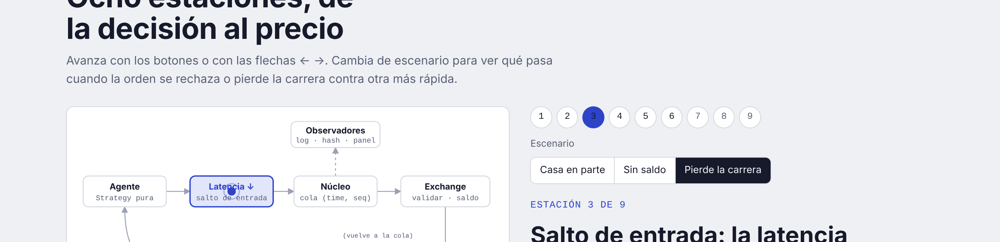
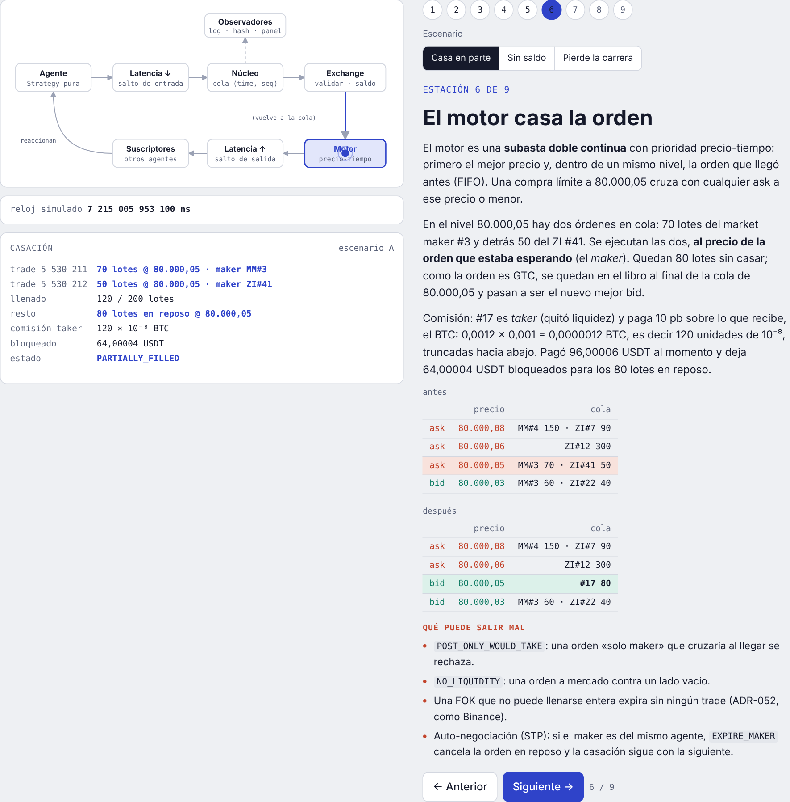
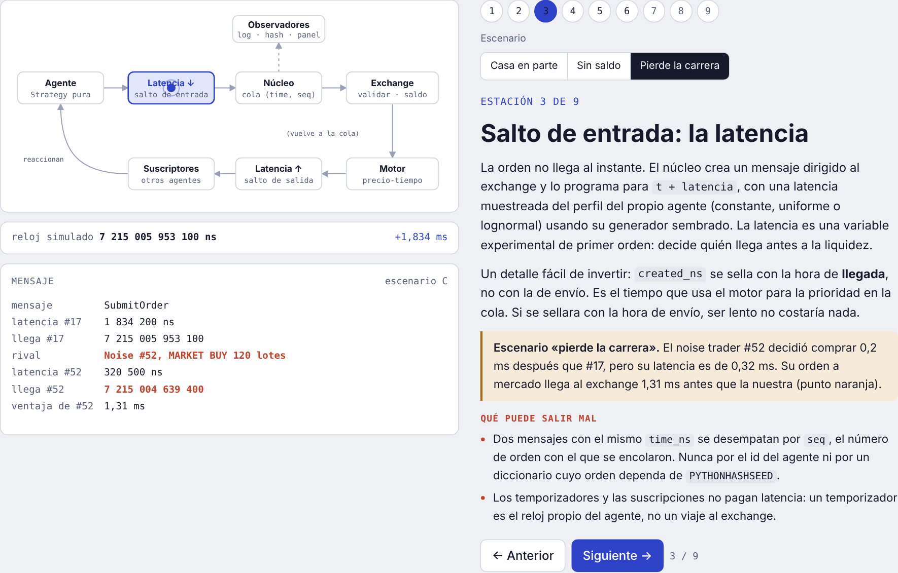
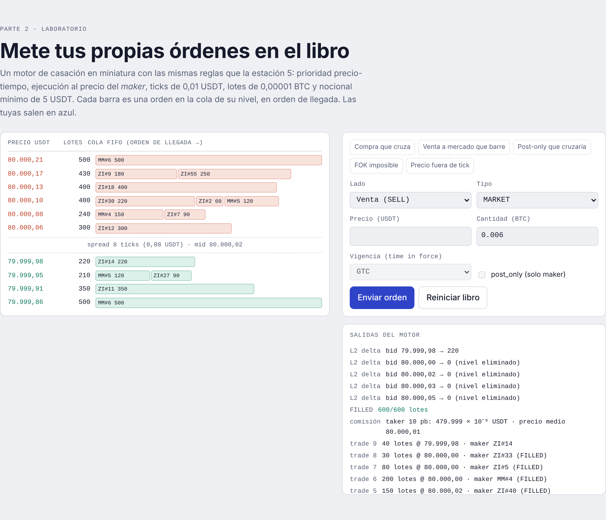
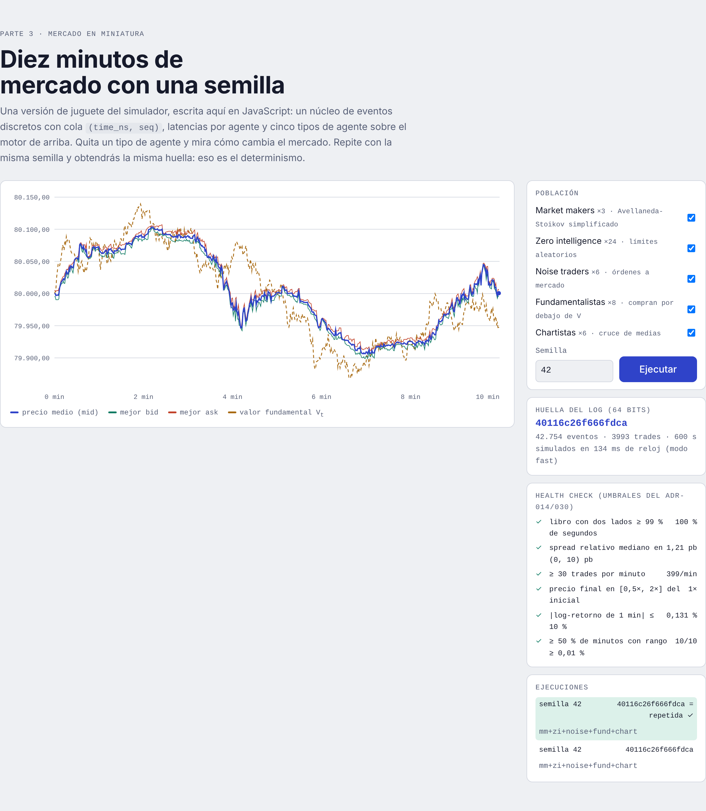
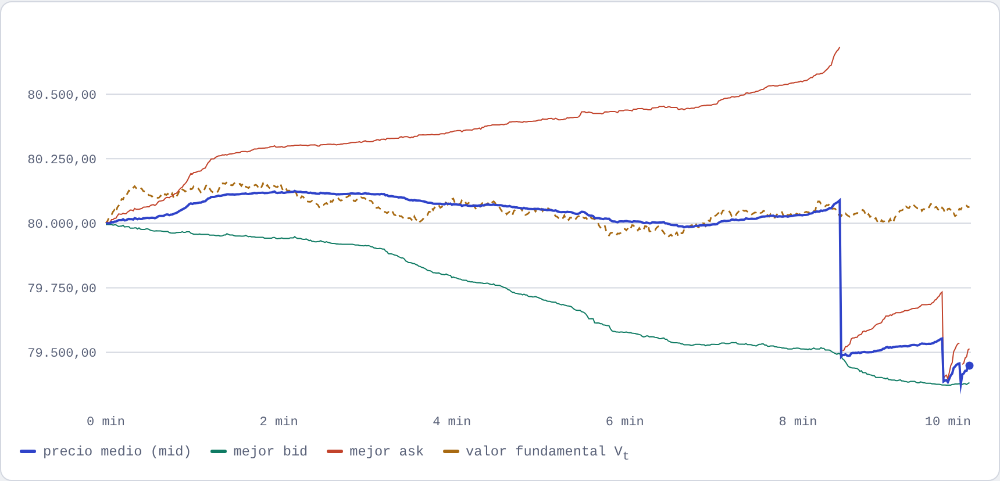

# El viaje de una orden

**Pruébalo aquí: https://raaauulg.github.io/prueba-de-concepto/**

Esto es una prueba de concepto para explicar de forma visual cómo funciona **MarketLab**, el simulador de microestructura de mercado que estoy montando para mi TFG (Grado en Ingeniería de Datos e IA, Universidad de León).

La idea la saqué de [request-journey](https://arnaucanet.github.io/request-journey/), que enseña el camino de una petición web paso a paso. Yo he hecho lo mismo pero con una orden de compra de BTC: sigues una orden desde que un agente decide comprar hasta que se casa en el libro y el resto de agentes reaccionan. Al final del recorrido se ve que el precio no lo pone nadie, sale solo de cómo interactúan los agentes.

## Qué hay dentro

La página tiene tres partes:

### 1. Recorrido guiado (las 8 estaciones)

Una compra de 0,002 BTC pasa por todo el simulador:

1. **Agente**: un fundamentalista cree que el BTC está barato y decide comprar.
2. **La orden en enteros**: el precio se pasa a ticks y la cantidad a lotes. En el núcleo no hay ni un float (así el resultado es reproducible bit a bit).
3. **Latencia de entrada**: la orden tarda en llegar al exchange, y eso cuenta para la prioridad en la cola.
4. **Cola del núcleo**: un min-heap ordenado por `(time_ns, seq)`. Es una simulación de eventos discretos, así que no hay reloj de pared.
5. **Exchange**: valida tick, lote, nocional mínimo y saldo, como Binance spot.
6. **Motor de casación**: prioridad precio-tiempo (FIFO), el trade sale al precio del maker y se cobra la comisión.
7. **Salida**: informes de ejecución, trades públicos y deltas L2 a cada agente, con su propia latencia.
8. **Registro**: todo va a un log y al final se saca un hash. Misma config + misma semilla = mismo hash.

Además hay tres escenarios para ver qué pasa cuando algo sale mal: la orden casa en parte, se rechaza por falta de saldo o pierde la carrera contra un agente más rápido.

En el escenario «pierde la carrera» un noise trader con menos latencia llega 1,3 ms antes y se lleva la liquidez. Con la misma decisión, ser más lento te deja con una orden pasiva en vez de ejecutada:

### 2. Laboratorio del libro de órdenes

Un motor de casación pequeño donde puedes meter tus propias órdenes (LIMIT, MARKET, GTC/IOC/FOK, post-only) y ver cómo se van comiendo la cola de cada nivel. También salen los rechazos típicos: precio fuera de tick, nocional mínimo, post-only que cruzaría, FOK que no se puede llenar...

### 3. Mercado en miniatura

Una versión de juguete del simulador hecha en JavaScript, con cinco tipos de agente (market makers, zero intelligence, noise traders, fundamentalistas y chartistas) y 10 minutos de mercado simulado. Le pasas una semilla y se calcula todo en tu navegador en menos de un segundo. También pasa un health check con los mismos umbrales que uso en el simulador real.

Lo más interesante es ir quitando tipos de agente. Por ejemplo, sin market makers el spread se dispara (de ~1 pb a decenas de pb) y el libro se queda bastante vacío:

Y si repites con la misma semilla te sale la misma huella. Eso es justo lo que pido al simulador de verdad.

## Ojo: esto NO es el simulador real

Esta página es solo para explicar las ideas. El simulador de verdad está en Python, corre en una VM y es bastante más completo: saldos, órdenes stop, prevención de auto-negociación, calibración con datos reales de Binance capturados en directo, SHA-256 sobre el log, etc.

Lo que hay aquí está simplificado a propósito:

- Los valores del recorrido son un ejemplo coherente con las reglas, no la salida de una ejecución concreta.
- El mercado en miniatura no tiene saldos ni órdenes stop, y los agentes leen el libro sin latencia de salida.
- La huella es un hash de 64 bits, no SHA-256.

## Cómo verlo en local

Es un único `index.html` sin dependencias (solo carga fuentes de Google Fonts). Lo descargas y lo abres con el navegador. Ya está.

## Para qué sirve todo esto

El experimento final del TFG es comparar el mismo conjunto de estrategias en tres entornos:

- **R1**: backtest ingenuo con datos reales y sin costes.
- **R2**: backtest con comisiones, spread e impacto.
- **R3**: dentro del mercado simulado con agentes, donde mis órdenes mueven el precio.

Si el ranking de estrategias cambia de un entorno a otro, un backtest normal te estaría engañando. Para eso necesito un mercado simulado que se parezca al real, y esta página es una forma de enseñar cómo está hecho por dentro.

---

Hecho por Raúl Gómez · TFG Ingeniería de Datos e IA · Universidad de León
